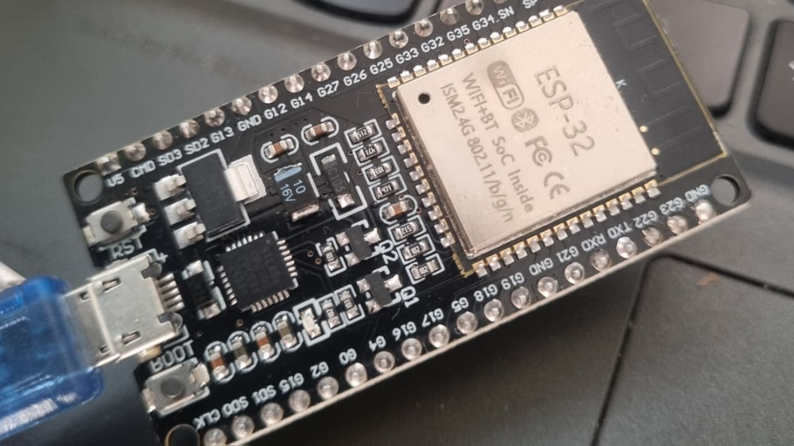
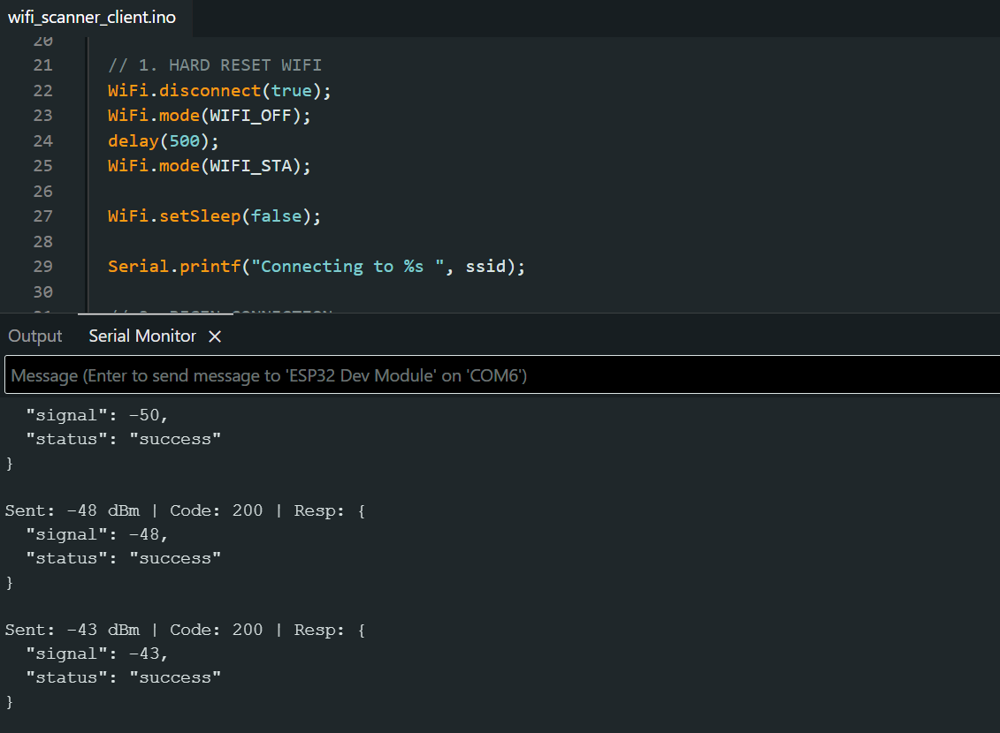
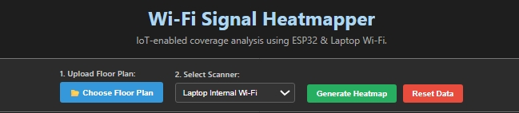
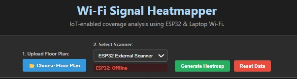
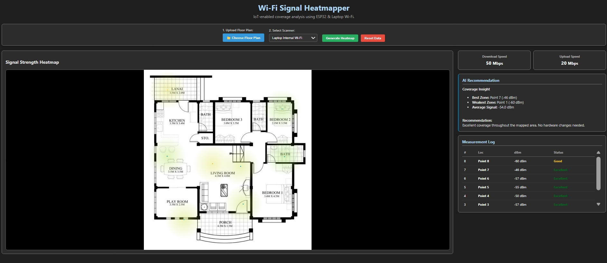
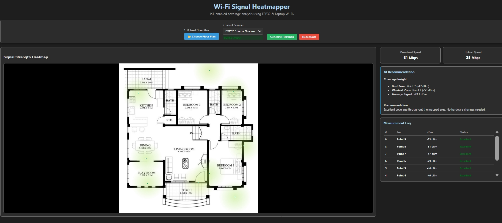

# 📡 Wi-Fi Signal Heatmapper

  

**Wi-Fi Signal Heatmapper** is an intelligent, IoT-enabled wireless coverage analysis tool designed to transform invisible signal data into interactive, real-time heatmaps.

By leveraging a **Python Flask** backend and **ESP32 hardware**, this tool allows users to map their physical space, detect dead zones, and receive AI-driven recommendations for optimizing router placement.

---

## 📸 Project Demo

### 1. Hardware Setup
The core of the system: An ESP32 microcontroller configured as a Wi-Fi station. It actively scans for RSSI (Received Signal Strength Indicator) values and transmits them to the central server.


### 2. Firmware & Telemetry Logic
The Arduino IDE Serial Monitor showing the internal logic. The ESP32 captures the signal (e.g., `-50 dBm`) and receives a `200 OK` JSON response from the Flask backend, confirming data reception.


### 3. Dashboard Initialization
The initial web interface. Users upload their custom floor plan and select their scanning mode. Here, the "Laptop Internal Wi-Fi" is selected for simulation/testing mode.


### 4. IoT Connection Monitor (Offline)
The system features real-time device health monitoring. If the ESP32 is powered down or disconnected, the dashboard instantly flags the status as "Offline" (Red).


### 5. IoT Connection Monitor (Online)
Once the ESP32 connects to the network, the dashboard performs a handshake and updates the status to "Online" (Green), indicating it is ready to map data points.


### 6. Real-Time Measurement Logging
As the user walks through the room and clicks on the map, the system logs measurement points. The "Measurement Log" on the right records the exact location, dBm value, and signal quality (Excellent/Good/Fair) for every step.


### 7. Final Heatmap & AI Analytics
The completed analysis. The Canvas engine renders a color-coded heatmap (Green = Strong, Transparent/Red = Weak). The AI module on the right calculates the "Best Zone," "Weakest Zone," and provides actionable hardware recommendations.


---

## 🚀 Key Features

### 1. 📡 IoT-Powered Scanning
- **Hardware Integration:** Uses an ESP32 microcontroller to capture accurate RSSI data.
- **Wireless Telemetry:** Transmits sensor data wirelessly to the dashboard over local Wi-Fi.

### 2. 🗺️ Interactive Heatmaps
- **Canvas Rendering:** Uses HTML5 Canvas to draw smooth, semi-transparent signal gradients.
- **Adaptive Scaling:** Automatically resizes high-resolution floor plans for pixel-perfect plotting.

### 3. 🤖 AI Coverage Analysis
- **Dead Zone Detection:** Automatically identifies the location with the lowest signal strength.
- **Smart Recommendations:** Suggests specific hardware changes (e.g., "Place extender near Kitchen").

### 4. ⚡ Dual-Mode Operation
- **Simulation Mode:** Test the UI without hardware using the Laptop script.
- **Live Mode:** Connect the ESP32 for professional-grade site surveys.

### 5. 📊 Real-Time Analytics
- **Visual Logs:** Color-coded data tables for immediate network health checks.
- **Detailed Tracking:** Logs every scanned point with location name, signal strength (dBm), and quality.

---

## 🛠️ Tech Stack

| Component | Technology | Role |
| :--- | :--- | :--- |
| **Frontend** | HTML5, CSS3, JS | Responsive dashboard, dark theme, and Canvas rendering. |
| **Backend** | Python (Flask) | REST API, data processing, and application serving. |
| **Logic** | Python | Modular intelligence and utility functions. |
| **Hardware** | ESP32 (Arduino C++) | Physical edge node for Wi-Fi signal scanning. |
| **Comms** | HTTP / JSON | Wireless data transmission between ESP32 and Laptop. |

---

## 📂 Project Structure

```text
WIFI-HEATMAPER/
├── assets/
│   └── floor_plans/       # Stored and uploaded floor plan images
├── backend/
│   ├── app.py             # Main Flask server
│   ├── intelligence.py    # Analytics logic (Heatmap & Recommendations)
│   ├── utils.py           # Helper functions
│   └── requirements.txt   # Python dependencies
├── frontend/
│   ├── index.html         # Dashboard UI
│   ├── script.js          # Canvas rendering & API calls
│   └── style.css          # Styling
├── scanners/
│   ├── esp32/
│   │   └── wifi_scanner_client.ino  # Arduino code for ESP32
│   └── laptop/
│       └── laptop_scanner.py        # Python script for laptop scanning
├── .gitignore
└── README.md

```

---

## 📦 How to Run Locally

### 1. Clone the Repository

```bash
git clone [https://github.com/yourusername/Wifi-Signal-Heatmapper.git](https://github.com/yourusername/Wifi-Signal-Heatmapper.git)
cd Wifi-Signal-Heatmapper
```

### 2. Set Up Virtual Environment

```bash
# Windows
python -m venv venv
venv\Scripts\activate

# Mac/Linux
python3 -m venv venv
source venv/bin/activate
```

### 3. Install Dependencies

```bash
cd backend
pip install -r requirements.txt
```

### 4. Configure Hardware (ESP32)

1. Open `scanners/esp32/wifi_scanner_client.ino` in **Arduino IDE**.
2. Update the configuration variables:
```cpp
const char* ssid = "YOUR_WIFI_NAME";
const char* password = "YOUR_WIFI_PASSWORD";
String serverIP = "YOUR_LAPTOP_IP"; // e.g., 192.168.1.10
```


3. Connect your ESP32 via USB and upload the code.

### 5. Run the Application

```bash
# In the backend directory
python app.py
```

**Access the dashboard at:** `http://localhost:5000`

---

## 🎮 How to Use

1. **Upload Floor Plan:** On the dashboard, upload an image of your room or building layout.
2. **Select Device:** Choose **ESP32** for real hardware scanning or **Laptop** for simulation.
3. **Start Mapping:** Click on the map where you are currently standing.
4. **Scan:** The system will record the signal strength at that point.
5. **Repeat:** Move to different locations and click on the map to build a comprehensive view.
6. **Analyze:** Click **"Generate Analytics"** to see the heatmap, identifying best and worst coverage zones.

---

## 📄 License

This project is open-source and available under the **MIT License**.

© 2026 Wi-Fi Signal Heatmapper

Built with ❤️ by **Anupam Jadhav**